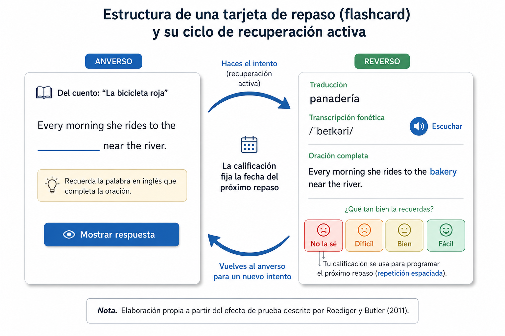
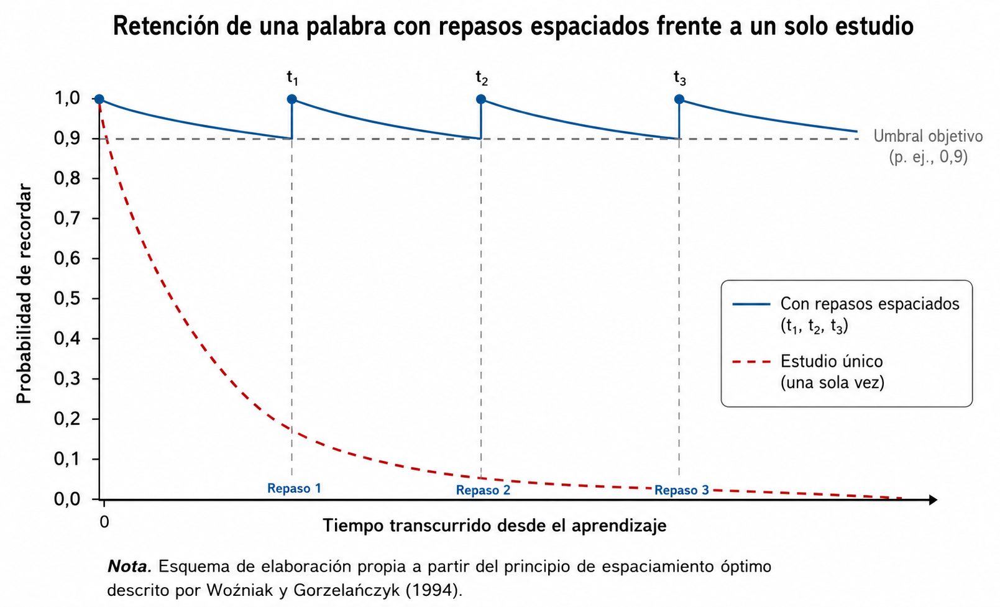

# Marco Teórico

> Documento de Taller de Grado I — UMSS · Proyecto **Wordglow**

_Última actualización: 2026-08-31_
_Estado: fundamentación preliminar (borrador para revisión del tutor)._

---

# CAPÍTULO 2. APRENDIZAJE DE VOCABULARIO EN INGLÉS ASISTIDO POR DISPOSITIVOS MÓVILES Y REPETICIÓN ESPACIADA

Aprender a leer en inglés depende de una cosa antes que de cualquier otra: conocer
suficientes palabras. Este capítulo fija los conceptos que sostienen la propuesta de
Wordglow —una aplicación móvil que combina cuentos breves, palabras interactivas y
repaso espaciado— y descarta lo que pertenece a la fase de implementación (lenguajes,
servicios, metodología de desarrollo, diseño de interfaz).

## 2.1. Objeto de estudio

El objeto de estudio es el aprendizaje de vocabulario receptivo del idioma inglés
apoyado por una aplicación móvil, donde la lectura de textos breves y un mecanismo de
repetición espaciada forman el núcleo del proceso.

## 2.2. Aprendizaje de vocabulario en una lengua extranjera

Conocer una palabra no es saber su traducción. Nation (2013) lo descompone en tres
dimensiones —forma oral y escrita, significado y uso— y sostiene que ese conocimiento se
construye por grados, a lo largo de muchos encuentros con la palabra en contexto. El
proyecto se centra en el vocabulario receptivo: las palabras que el lector reconoce y
entiende, aunque todavía no sepa producirlas.

Cuánto vocabulario hace falta depende de para qué. Nation (2013) lo cuantifica en
familias de palabras —una base y sus formas derivadas— y lo asocia a la cobertura
léxica, el porcentaje del texto o del discurso que ese vocabulario permite entender
(Tabla 1).

**Tabla 1**

*Vocabulario necesario para hablar y leer en inglés según la meta de uso*

| Meta de uso                                          | Familias de palabras | Cobertura léxica aproximada |
| ---------------------------------------------------- | -------------------- | ---------------------------- |
| Conversación cotidiana (comunicación oral básica) | ~2 000-3 000         | ~95 % del discurso hablado   |
| Participar con comodidad en el discurso oral         | ~6 000-7 000         | ~98 % del discurso hablado   |
| Empezar a leer textos auténticos sencillos          | ~3 000-4 000         | ~95 % del texto escrito      |
| Leer con autonomía novelas y periódicos sin apoyo  | ~8 000-9 000         | ~98 % del texto escrito      |

*Nota.* Adaptado de Nation (2013). La comprensión razonable empieza cerca del 95 % de
cobertura; la lectura fluida sin ayuda externa exige alrededor del 98 %.

La distancia entre 3 000 y 9 000 familias marca el terreno donde trabaja Wordglow.
Schmitt (2008) precisa cómo se recorre: la enseñanza explícita funciona, pero la
retención se juega en los encuentros repetidos y espaciados con la palabra en contextos
con sentido. De ahí la mecánica del proyecto: cada palabra que aparece en un cuento
puede reaparecer, en el momento programado, en una sesión de repaso.

## 2.3. Memoria y recuperación activa

Releer algo no lo fija en la memoria; intentar recordarlo, sí. Roediger y Butler (2011)
llaman a esto efecto de prueba (*testing effect*): recuperar la información desde la
memoria produce una retención a largo plazo mucho mayor que volver a leerla o
reconocerla de forma pasiva. El efecto crece cuando esos intentos se reparten en el
tiempo en lugar de amontonarse en una sola sesión.

Una tarjeta de repaso con autoevaluación aplica ambos principios a la vez. El aprendiz
intenta recordar el significado antes de comprobarlo, y el sistema decide cuándo repetir
ese intento (Figura 1).

**Figura 1**

*Nota.* Elaboración propia a partir del efecto de prueba descrito por Roediger y Butler
(2011).

## 2.4. Repetición espaciada

La repetición espaciada programa cada repaso para el momento anterior al olvido probable,
con intervalos que se alargan a medida que la palabra se afianza (Woźniak y Gorzelańczyk,
1994). El objetivo es económico: mantener la retención sobre un umbral con el menor
número de repasos posible (Figura 2).

**Figura 2**

*Nota.* Esquema de elaboración propia a partir del principio de espaciamiento óptimo
descrito por Woźniak y Gorzelańczyk (1994).

El algoritmo SM-2 de SuperMemo (Woźniak y Gorzelańczyk, 1994) es la implementación
clásica de esa idea. Cada tarjeta guarda un intervalo y un factor de facilidad; tras
cada respuesta, calificada de 0 a 5, el intervalo se multiplica por el factor cuando el
aprendiz acierta y se reinicia cuando falla. Como los parámetros viven en la tarjeta, el
repaso se adapta a la dificultad de cada palabra y a cada usuario sin necesidad de datos
de terceros.

Wordglow parte de un repaso tipo SM-2 y añade una regla de prioridad: primero las
palabras en estado "aprendiendo" y las vencidas del día.

## 2.5. Estados de conocimiento de una palabra

Si el conocimiento de una palabra es gradual (Nation, 2013), el sistema necesita
representarlo con más de dos valores. Wordglow usa cuatro estados, codificados por color
sobre la palabra en el texto (Tabla 2).

**Tabla 2**

*Estados de conocimiento de una palabra en el modelo del proyecto*

| Estado      | Significado para el aprendiz                    | Tratamiento en la aplicación                            |
| ----------- | ----------------------------------------------- | -------------------------------------------------------- |
| Nuevo       | La palabra no ha sido vista o marcada aún.     | Se resalta; entra al repaso como ítem nuevo.            |
| Aprendiendo | Reconocida con esfuerzo o con fallos recientes. | Se resalta; prioridad alta en el repaso.                 |
| Dominado    | Reconocida de forma estable y automática.      | Puede mostrarse sin resalte; repaso a intervalos largos. |
| Ignorado    | Nombre propio, marca o topónimo.               | Sin resalte; excluida de métricas y de repaso.          |

*Nota.* El estado es global: vale para todas las apariciones de la palabra en cualquier
cuento, no para un cuento concreto.

## 2.6. Estado del Arte

Los tres pilares de Wordglow tienen respaldo por separado. En vocabulario, Nation (2013)
y Schmitt (2008) coinciden en que el aprendizaje exige encuentros repetidos y espaciados
en contextos con significado. En memoria, Roediger y Butler (2011) sitúan la
recuperación activa y distribuida como el mecanismo que fija lo aprendido. En algoritmos,
el SM-2 de Woźniak y Gorzelańczyk (1994) sigue siendo la referencia para programar esos
repasos por ítem.

Las herramientas actuales cubren piezas sueltas. Duolingo aplica repetición espaciada
sobre contenido fijo; Anki lo hace sobre tarjetas que crea el usuario, sin texto de
lectura; LingQ y Readlang ofrecen lectura con palabras interactivas y traducción al
tocar, pero con un repaso limitado. Ninguna reúne en una sola herramienta el cuento
diario generado y graduado con IA, el repaso espaciado cuyas tarjetas salen del propio
texto leído y el acompañamiento con imagen y lectura en voz alta con seguimiento visual.

Ese acompañamiento multimodal abre además un problema técnico sin solución estándar: el
resaltado palabra por palabra durante la síntesis de voz en móviles. Los eventos de
límite de palabra de los sintetizadores son poco fiables, y la alternativa razonable es
apoyarse en las marcas de tiempo que entrega el proveedor de voz.

El sistema de conceptos completo y el cuadro comparativo de soluciones están en
`documento/investigacion/estado_del_arte/sistema_de_conceptos_y_estado_del_arte.md`. La
bibliografía del capítulo está en `documento/bibliografia/referencias.md`.
